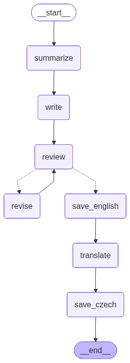

# eve

eve, popsci-writer-agent 2.0

using langgraph

## workflow

## todo

- [X] fix the output from dict to plain text
- [ ] pass summarization to review agent too for factchecking
- [X] move temperatures to parameters.py
- [X] logging to see them in action
- [ ] image generation based on article content (at least thumbnail)