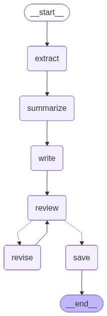

# eve

eve, popsci-writer-agent 2.0

using langgraph

## workflow

## todo

- [X] fix the output from dict to plain text
- [X] pass original paper to review agent too for factchecking
- [X] move temperatures to parameters.py
- [X] logging every node to see them in action
- [ ] image generation based on article content (at least thumbnail)
- [ ] track headlines and add penalized words? (too many tug-of-wars)